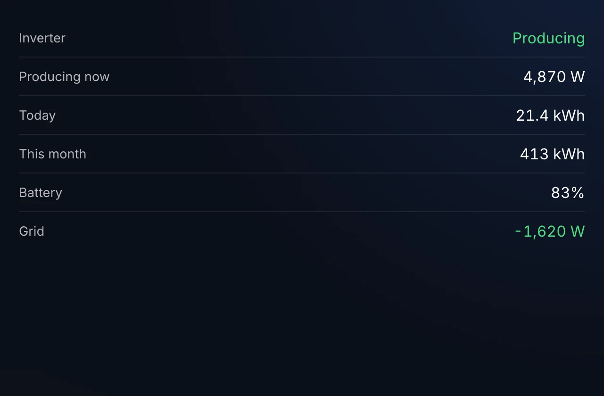
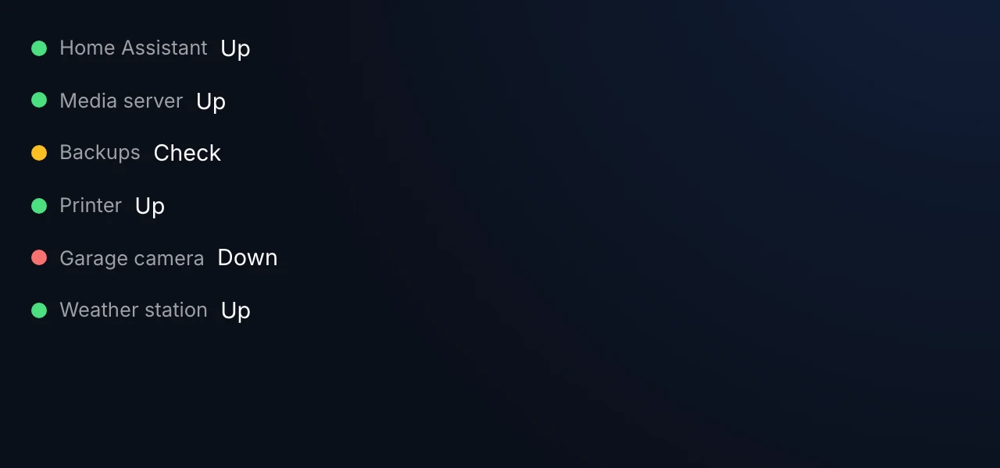
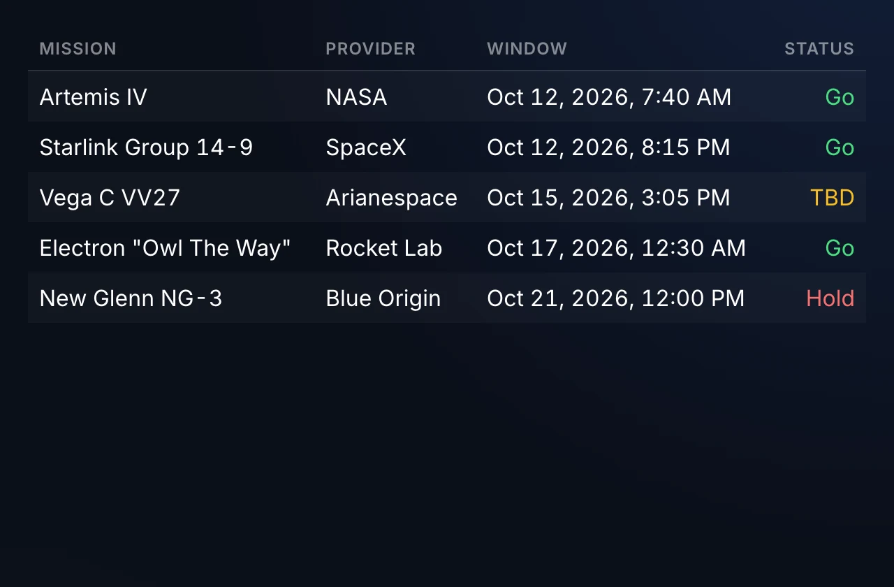

# JSON Data Block Plugin

A plugin for [Home Screens](https://homescreens.dev) — the open-source smart display system for Raspberry Pi — that fetches any JSON API and displays it as single values, key-value lists, tables, card grids, or status boards with per-field formatting and conditional rules.



## Features

- **5 display modes**: Single Value, Key-Value List, Table, Card Grid, Status Board
- **Any JSON endpoint**: GET / POST / PUT / PATCH with custom headers and body
- **Auth support**: Bearer token, API key header, API key query param, or HTTP Basic — credentials stored server-side via the Home Screens secrets proxy
- **Per-field formatting**: number precision, units, date formatting, template strings
- **Conditional rules**: drive colors, icons, and visibility from field values (e.g. red when status != "OK")
- **Nested path selection**: pull deeply-nested fields with dotted paths
- **Configurable refresh + cache**: independent client poll interval and server-side cache TTL
- **Stale-data indicator** when a fetch fails and cached data is being served

## Screenshots

| Status board | Table |
|---|---|
|  |  |

## Installation

Install this plugin from the Plugin Store inside the Home Screens editor, or download a release tarball from the [Releases](https://github.com/home-screens/home-screens-plugin-json-data/releases) page and side-load it.

For general Home Screens setup, see the [documentation](https://homescreens.dev/docs).

## Configuration

JSON Data Block ships a custom configuration panel in the Home Screens editor that guides you through:

1. **Endpoint** — URL, HTTP method, custom headers, request body
2. **Authentication** — none / bearer / API key (header or query) / basic
3. **Display mode** — pick one of the five modes and configure fields, columns, or status tiles
4. **Formatting rules** — per-field number/date/template formatting and conditional styling
5. **Refresh & cache** — client poll interval and server-side cache TTL

Because the plugin is generic, there are too many options for a flat table here — the in-editor panel is the source of truth.

### Permissions

This plugin declares `network` and `secrets` permissions and uses wildcard (`*`) allowed domains so you can point it at any JSON API. Credentials you enter under **Authentication** are stored server-side and never exposed to the browser.

## Building

```bash
npm install
npm run build   # Produces dist/bundle.js
npm run dev     # Watch + serve on localhost:5173 for dev-mode loading
```

See the [plugin template README](https://github.com/home-screens/home-screens-plugin-template) for details on the plugin SDK, manifest format, and development workflow.

## License

MIT
